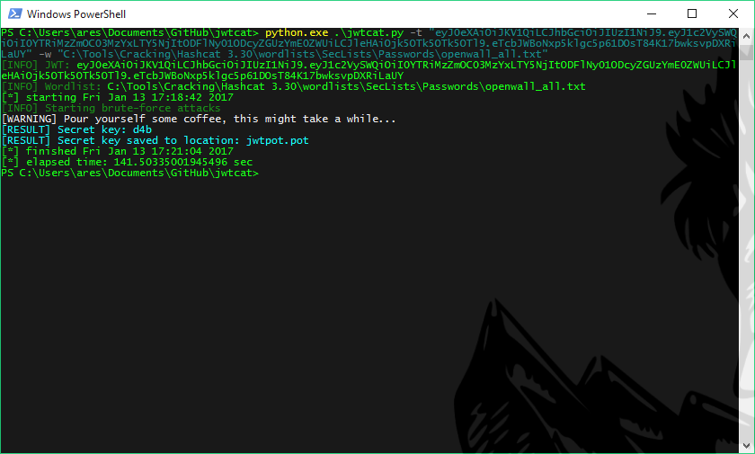

# jwtcat
## Bruteforcing JSON Web Token.

This script performs brute-force attacks against the JSON Web Token (JWT) to discover the secret key used to sign the JWT. 

*N.B. This script is only configured to work with signatures generated using the 'HS256' hashing algorithm.*

More information about JWT vulnerabilities can be found at:

<https://auth0.com/blog/critical-vulnerabilities-in-json-web-token-libraries/>

## Installation
	$ git clone https://github.com/AresS31/jwtcat
	$ cd jwtcat
    # pip install -r requirements.txt

### Usage
        $ python3 jwtcat.py [-h] -t TOKEN [-v] -w WORDLIST

    [-t, --token]:      JSON Web Token 
    [-v, --verbose]:    enable verbose -- display every attempt
    [-w, --wordlist]:   wordlist containing the passwords -- one per line
    [-h, --help]:       print help

## Dependencies
### Third-party libraries
#### colorama 0.3.7:
The *python3-colorama* package is required. 

<https://pypi.python.org/pypi/colorama>

#### jwt 0.3.2: 
The *python3-jwt* package is required. 

<https://pypi.python.org/pypi/jwt/0.3.2>  

## Future Improvements
* Improve the code quality.
* Improve the runtime speed.

## License
   Copyright (C) 2017 Alexandre Teyar

Licensed under the Apache License, Version 2.0 (the "License");
you may not use this file except in compliance with the License.
You may obtain a copy of the License at

<http://www.apache.org/licenses/LICENSE-2.0>

Unless required by applicable law or agreed to in writing, software
distributed under the License is distributed on an "AS IS" BASIS,
WITHOUT WARRANTIES OR CONDITIONS OF ANY KIND, either express or implied.
See the License for the specific language governing permissions and
   limitations under the License. 
